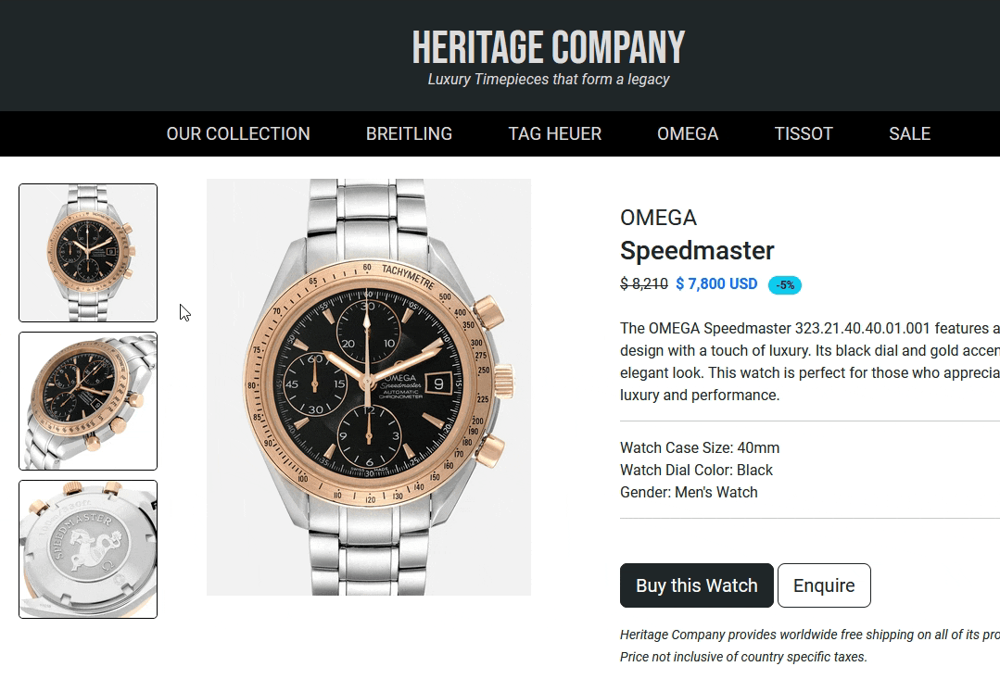
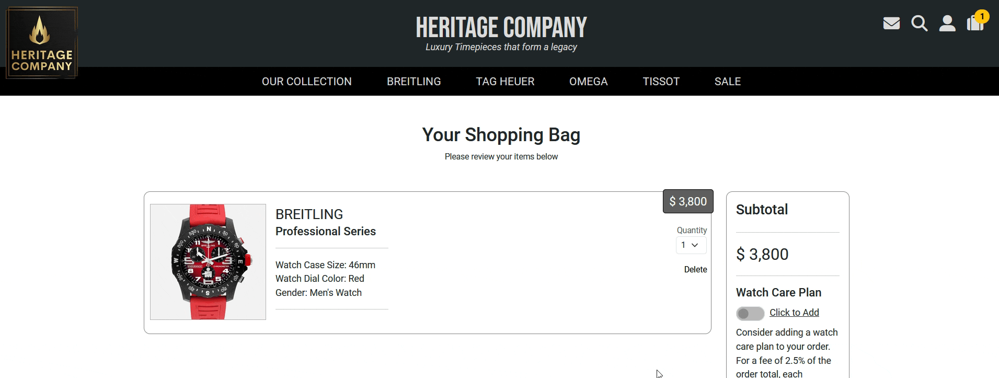
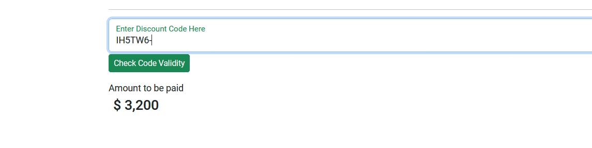

# Heritage Company

Welcome to the Readme file for Heritage Company, a fully-fledged e-commerce site, selling luxury timepieces, and built with [Django](https://www.djangoproject.com/).


<br>

- **[Link to Live Site](https://heritage-company.net)**

<br>

- [Link to Github Project Board](https://github.com/users/leonp84/projects/4)

<hr>

# Table of Contents

Xx

# Overview

Heritage Company is a fully operative e-commerce platform selling luxury watches from the well-known Swiss brands _Breitling_, _Tag Heuer_, _Omega_ and _Tissot_. Customers can browser products and make purchases through a functioning checkout system that includes email verification. The site and product display have been carefully designed to be visually appealing to the targeted demographic.

# UX

## User Stories

### User

All User Story cards can be viewed on the [Github Project Board](https://github.com/users/leonp84/projects/4)

<hr>

1. **[EPIC 1: \_\_](__)** - \_\_
<br>
<details>
<summary> User Stories for Epic: __</summary>
<br>

> [#\_\_](__) \_\_

</details>
<hr>

### Site Administrator

1. **[EPIC 23: Admin User Functionality](https://github.com/leonp84/code-institute-project-5/issues/23)** - A set of features that allow site superusers to add, edit or remove new products to the webstore.
<br>
<details>
<summary> User Stories for Epic: Admin User Functionality</summary>
<br>

> [#\_\_](__) \_\_

</details>
<hr>

# Business Model

Heritage Company sells **luxury timepieces** to upper middle-class clientele who either have sufficient disposable income (or are willing to take on debt) to outright purchase a product in the range of thousands of dollars. To understand this business model, it is it perhaps necessary to understand the philosophy behind luxury timepieces.

## Luxury Watches – The Philosophy

Luxury watches are, in the true sense, not rare items (since they are usually mass produced) but give the semblance of rarity and are undoubtedly icons of status among those that can afford to where them. Browsing the respective websites of the four popular Swiss watch brands sold on Heritage Company, it becomes clear that, while each target upper middle-class individuals with plenty of disposable income, each also variate somewhat is their precise demographic:

- [Tag Heuer](https://www.tagheuer.com/): Sporty, adventure seeking up and coming professionals
- [Breitling](https://www.breitling.com/): Younger upper middle-class buyers looking for a touch of tradition with their purchase.
- [Omega](https://www.omegawatches.com/): An older, established clientele with more disposable income and higher-net worth than others on this list.
- [Tissot](https://www.tissotwatches.com/): Lower end middle class buyers with less disposable income, but who want to take the first step into watch collection.

All four brands understand (and have inspired the business philosophy of Heritage Company too) that with luxury timepiece, one sells not a mechanical product that customers use to check the time (though that too), but one primarily **sells a lifestyle and a story**. A story of rarity, luxury and status.

## Heritage Company – The Story

In the case of Heritage Company, the story is additionally built around the idea of family legacy and tradition. Of a luxury timepiece being an heirloom that travels with one through the important rites of passage of life. This idea is reflected in the text on the landing page, the about us page, and of course, the company title!

To summarize: Heritage Company is therefore designed with this demographic in mind: Young, up and coming middle and upper-middle class clientele, who are possible starting families, and have disposable income or the ability to quickly procure debt.

# Marketing Strategy

The three primary goals, the driving force behind the site design and UX) of heritage-company.net are (in order of most importance):

(1) Make a purchase: Buy a single item (or multiple items), making use of the upselling during checkout for additional profit.
(2) Sign up for a newsletter: Studies consistently show that potential customers interact better with niche-driven email marketing, than general marketing such as Google AdWords.
(3) Create an account.

To this end, the site funnels users, from the landing page, towards specific products and the eventual checkout process. Making the shopping and checkout process as _frictionless as possible_. Newsletter sign-ups are encouraged, by making use of static and additional dynamic sign-up notifications. And creating an account is a simple process needing just an email address and password.

## Future Marketing Ideas

Future marketing strategies should incorporate blog articles about watch collection and luxury timepiece related news. For especially collectors, fresh information like this, presented in a well written (and SEO spider friendly) manner are highly desirable. Investing in good written material, producer by a luxury watch expert, could be a valuable selling strategy to keep users coming back. These articles can then of course be promoted through the site newsletter or social media pages.

To that end the site also employs social media marketing through a dedicated Facebook Business page which can be viewed here: Xx

Xx Add Facebook Page Screenshots

# SEO

During the planning stage of the product, [wordtracker](https://www.wordtracker.com/) was used to identify some of the most useful and valuable SEO words related to luxury watches, Swiss watches and the four brands of watches that are sold on heritage-company.net. These keywords were then incorporated in different parts of the site design, especially page titles, <h1> tags, image alt descriptions, meta descriptive tags, and as general keywords throughout the text content of the site (naturally avoiding any semblance of keyword stuffing).

_Keyword Results courtesy of the free version of Wordtracker_


## Google Search Console

After registering the domain with Google search console and verifying ownership by updating the DNS records, the [sitemap.xml](https://heritage-company.net/sitemap.xml) and [robots.txt](https://heritage-company.net/robots.txt) files were submitted to Google search console.

_Sitemap.xml report from Google Search Console_


The site was successfully crawled, with robots.txt showing no errors, and shows up in Google search results when searching, for example using the phrase “heritage company watches”. Note that Google search results are (to a degree) location and user specific so the same results might not show up for others.

_Robots.txt report from Google Search Console_


# Visuals

The site design speaks to the targeted customer demographic by incorporating sleek visuals and dark and black themes (associated with luxury). The following colour palette was used throughout.

_Colour Palette by [Coolors.co](https://coolors.co)_


# Logo

The website logo was created with the help of the AI Logo creation tool from [Looka](https://www.looka.com). It features the company name and a fire symbol in gold, surrounded by a golden border. The fire symbol was chosen as the company identifier since it ties in with the Heritage/Legacy theme espoused on the landing page and about us page. It is based on the quote from Gustav Mahler: ‘Tradition is not the worship of ashes, but the transmission of fire.


# Wireframing

During the planning phase of the project, wireframes was designed for desktop and mobile versions of the main landing page, the product list display page, and a product details page. The current, deployed version of the project closely resembles these original designs.

Wireframing was done with [Balsamiq](https://balsamiq.com/) software.

_Landing Page Wireframe_


_Product Display Page Wireframe_


_Product Details Wireframe_


# Flowchart

During the planning phase, the following flowchart was designed to show customer/user interaction with the website. The flowchart includes database interaction, but some elements (such as the ‘Review Shopping Experience’ step post order) was abandoned during development as it didn’t fit the vision of the project.


From an e-commerce perspective, the red lines show the preferred, and most desirable, navigation path a user can take.

# Model Design and Relationships

The Entity Relationship Diagram (ERD) below (by [dbdiagram.io](https://dbdiagram.io/)) visually displays the database design. For more detailed explanations of the relationships between models, and their purpose, it is recommended to read the Django view docstrings in the respective views.py and models.py pages of each app. There the model relationships are explained in detail.


# Features

## Landing Page

The site landing page was designed to be as visually arresting and enticing for first time visitors as possible, while not being too distracting or cluttered. At the top of the landing page, the hero section consists of a carousel of two particularly sought after luxury timepieces that customers can view and buy. Using visually arresting imagery here sets the tone for the rest of the landing page.

_Hero Section Image Carousel_


The four brands of Swiss watches sold on heritage-company.net are then shown as clickable visual links (with a hover effect) encouraging users to start browsing products.

_Links to Product Brands_


The rest of the landing page consists of text and imagery, including a parallax image and some customer testimonials, setting the stage for customers to browse further. Three popular products are also shown on the landing page.


The landing page uses visual effects where certain parts of the page dynamically blends into view as the user scrolls down the page.

## Header

The site header, displayed on every page, contains the company logo, name, and slogan, and account related links for users to search products, see their profiles, see their shopping bags, and contact the business. Below the header, an additional sticky navigation bar that lists links to the main product pages is shown. This remains visible to the user when they scroll down the page and ensures the most important links (for customers to make purchases) are consistently visible to users.

_The site header in desktop mode_


The site header dynamically updates depending on the screen width size, it is fully responsive showing the maximum number of information and icons in desktop mode, and only a minimum number of icons, with a drop-down menu, in mobile mode.

_The site header on small (mobile or small tablet) screens_


## Footer

Along with the header, the site footer is displayed on every page and contains two rows. The first row contains 3 columns: The 1st with a newsletter sign-up option where customers are encouraged to submit their e-mail addresses and receive the heritage company newsletter. The second column with links to various parts of the site. And the third column containing two (no-follow) social links to Facebook and LinkedIn, that open in new browser tabs. The footer is also fully responsive, showing fewer items in mobile mode. The newsletter signup remains present throughout.


The final row in the footer contains the copyright information and links to the privacy policy, terms and conditions, and the GitHub repository of the site designer.

## Newsletter Sign-up

On top of the static newsletter sign up form that are always displayed to users in the footer, an additional dynamic sign-up form is displayed to each user once per 24 hours.

**NOTE:** _This 24-hour timer (a Django session variable) can be reset by visiting the site’s privacy policy page. That view resets the session variable and I specifically left it there to make testing this additional sign-up modal easy._


This additional newsletter sign-up modal slides in to view from the left border of the site once the user has scrolled down to at least 75% of the page contents of whatever page they are currently browsing. Users can then either submit the form or close this modal by clicking on the X. The gentle sliding animation, and the fact that users are not bombarded with this message at every visit of the site, means that it is only slightly obtrusive, but as statistics show can lead to a high increase in newsletter sign-ups.

Upon submitting the newsletter sign up form, users are redirected to a page asking them to confirm their e-mail addresses. When users visit their inbox and click on the e-mail confirmation link, they are brought back to heritage-company.net, where they are presented with a message that their newsletter sign up has been successful.


As enticement for users to sign up to the newsletter, a **discount code** is given to them upon successful e-mail verification. This discount code is dynamically generated and consists of 6 digits, both letters and numbers. Upon successful e-mail verification the code is generated, saved in the database, and then emailed to the customer in an additional, separate email. This code is then available for use during the checkout process.


## All Products

The All products page allows users to see the entire catalogue of watches available for purchase on heritage-company.net. All pages that display products in this manner use a grid system whereby each watch is contained within a box, showing a watch image and basic information including the product price below the image.


Watch images have a hover effect where if the user **hovers** with the mouse over the product display box, a _special effect_ switches the image of the watch to a different one and employs a zoom effect with transition. This provides a pleasant browsing experience for the user as they scroll through the selection of watches.


Each page that displays products also have a sticky search and filter bar that stays fixed the top of the page as the user scrolls down. This bar contains 2 buttons: A ‘Sort’ button that allows the user to reload the current page with the products sorted by price, either descending or ascending.


And a ‘Search’ button which, when clicked, scrolls back to the top of the page and opens the search bar allowing users to do basic keyword search of products. Clicking on any of the displayed products on this page will then take the user to a dedicated product detail page. More on that below.

## Brand Specific Pages

The site was deployed with 33 products in the catalogue/database (Superusers can of course add additional products. All luxury timepieces on heritage-company.net fall under one of four famous Swiss watch brands: Breitling, Tag Heuer, Omega, and Tissot. Clicking on the navigation bar link for one of these four companies then takes the user to a page displaying time pieces of that specific brand.

_The Breitling Product Page_


Like the ‘All Products’ page, listed products have a hover transition effect and clicking on any of the watch images leads users to a dedicated product page.

## Discounted Products

A final category of watches are discounted items that users can reach by clicking on the sale button in the navigation bar. This displays watches of all brands that are currently on discount.


Discounted items are displayed similarly as on other pages but have an addition of a discount percentage icon displayed in the top right of the product box. An updated price with discount considered, is also shown to the user.

## Product Search

On both the desktop and mobile versions of the navigation bar in the header, a search icon appears. Clicking on the search icon dynamically reveals a search bar that allows users to do basic keyword search.


Any keywords entered into the search bar and then submitted, returns a list of search results where the keywords are either in the title or description of the watches. The search bar also contains a filter icon that allows users to do advanced search using product filter.


## Advanced Search

The advanced search function allows users to search products by keyword using additional filters: watch brand, gender, dial colour and price range. Users can select some or all of the filters, and include keywords, or no keywords, as part of the search query.


Results then take into account all of the submitted information to return a query set of products matching the user’s filters. If no keywords were entered, this is indicated to the user on the search result page, but an additional message makes sure the user is aware that their other filters were taken into account during the search process.


## Product Details Page

The product detail page is where users can see all relevant information of a timepiece: its brand, title, price, description, watch case size, watch dial colour, and gender. Each product page displays a main image for the specific timepiece and two additional images that users can Click to see a full version of. Each currently focused image again has the option to be clicked revealing a near full screen size model with a large, zoomed version of the image.



Other features of this page include the ability to contact the store owner regarding a specific product, to add the watch to the user's shopping bag, and to add the item to the user's wish list.

Hovering over the bookmark icon displays a Bootstrap tooltip explaining to users that it's possible to add this image as a bookmarked image to their wish list.


Upon clicking this icon an asynchronous JavaScript message is sent to the server to determine whether the user is currently logged in an authenticated. If the user is logged in parenthesis and therefore has an active wish list), the item is added to the authenticated users wish list. If not, a special modal shows up encouraging users to sign in or create an account to add items to the wish list.


From a business perspective the most important button on this page is of course the ‘Buy this Watch’ button. When users click this a loading animation shows up and after 2 seconds a success message indicated that the watch was added to the user's shopping bag. At the same time the number of items in the bag is automatically updated in the NAV bar giving clear visual feedback to the user.


Users are limited to a Max of three items per product per shopping bag, and once users have reached this limit and try to add additional quantities of the same product to their bags, error message displays that the product limit has been reached.


## Product Contact

Clicking on the ‘Enquire’ button on any product details page opens a contact us modal. This modal contains 4 fields, two of which (the product related fields) are automatically pre-populated. If a user is authenticated and his or her name and e-mail address is saved to the database, this information is also pre-filled in the contact us form. In such a case the user only needs to type their message and click on the send message button. Submitting this form creates a message instance that is saved to the database and can be viewed by a superuser from the accounts page.


Successful form submission displayed a success message to users so that they know their message has been sent.

## Accounts: Sign-up and Login

Clicking on the accounts icon in the navigation bar leads users to a sign in Page if they are not yet authenticated. Here it is possible to sign in with an e-mail address and password. It is also possible to sign in with Google, using Django AllAuth social login library.


Users can also sign up for an account at heritage-company.net using an e-mail address and strong password, or similarly sign up using the Google social signup service. Users that have forgotten their passwords can also click the relevant link to be sent a password reset e-mail.

When creating new accounts, users are asked to verify their email address. They are automatically sent an email with a verification link. Clicking this link activated their accounts and redirects them to the login page.

Login, Logout and other similar account related action include success or failure messaging to the user (displayed via bootstrap toasts in the bottom left corner of the site), to ensure constant visual feedback is provided to users.

## Accounts: Profile Page

After account creation and login, the accounts icon takes users to their profile pages. Here they are personal and delivery information is displayed. Their wish list is shown, and a list of past purchases are also available. If no profile information is currently available for the new user, they are encouraged to update their profile and save the information so that this can automatically be used during checkout.


## Wish List

When users are logged in and choose to add specific products to their wish list, these items then show up in the wish list of the user on their accounts page. Users can easily remove items from their wish list by simply clicking the X or delete button next to any item in the wish list. All actions like these include messaging to show the user that their wish list has been successfully updated. This is also done through asynchronous JavaScript to avoid unnecessary page refreshes.


## Past Orders

The past purchases section of the ‘My account’ page lists each past purchase the customer has made on heritage-company.net. This includes vital order information such as the date, total and delivery information. Products and quantities ordered, as well as the prices and a watch care plan selection, is also shown in this section.


## Shopping Bag

The shopping bag page lists all items currently in the user shopping bag: Showing watch information, price, a quantity selector and a delete button for each item in the shopping bag. Users can update the quantities up to a maximum of three and the subtotal of the order is automatically calculated without page refresh, thanks to asynchronous JavaScript. Users can delete each product in the shopping bag also causing the subtotal to dynamically update.



In the column displaying the current order subtotal the user is also given the option to add a watch care plan with some information text explaining that for a fee of 2.5% of the order total each purchased timepiece comes with service and cleaning benefits.

Clicking this button also dynamically upsets the subtotal by adding 2.5% to the final price. The final price is constantly updated (with a visual loading spinner) when users make changes to the any interactive element on the page (item quantity, deleting items, adding watch care plan). This ensures the order total remains up to date and users are clearly informed through constant visual feedback.

 GIF

A yellow ‘Proceed to Checkout’ button redirects users to the checkout page. If all items have been removed from the shopping bag, this button is greyed out and disabled.

Finally, if users visit their shopping bag, but the bag is empty, a separate message encourages users to browse the product catalogue first.

## Checkout

On checkout users are redirected to a visually distinct checkout page without the regular header and footer of the rest of the site. This is to ensure a focused and distraction free checkout environment and is similar to the practice followed by many e-commerce stores. Here the order details and total are presented in table form and users are asked to fill in their personal and delivery information including any special instructions needed to fulfil the order. Logged in users (that have completed their profile data) naturally have this checkout form pre-populated with their data. Users are encouraged to sign in (before filling in the form) if they want to make use of this feature.


Below the ‘Continue to Payment’ button users here also have the option to enter a discount code. Upon Newsletter sign up, as mentioned above, users are given a six digit randomly generated discount code that automatically provides a $100 discount to any order on heritage-company.net. Entering the code here and clicking on the check code validity button, sends the code to the Django back end, via asynchronous JavaScript, where the code is checked against the database.



If the code is valid (i.e. currently in the database), a success message is shown to users and $100 taken off the grand total price of the order. If not, an error message is displayed, and users are given the opportunity to try again. The final step in locking in any discount is to then click on the continue to payment button.

## Create Account upon checkout

Before proceeding to payment, users are given the opportunity to create an account with a temporary password, saving their current delivery details to their new accounts. This option is of course only available to non-authenticated users.


If this option is chosen and the ‘Continued to Payment’ button is clicked, then a new user account with a randomly generated 8-digit strong password is created (using the order e-mail address as login), and the user is sent an account verification e-mail, and a separate e-mail with their temporary password. If non-authenticated users try to create an account using an email that is already tied to an existing account, users are shown an error message and returned to the landing page. From here they can login and complete the order.

These are sent using Gmail's SSL encrypted SMTP server. Users are then encouraged to verify their e-mail address, log in with their temporary password, and naturally change their password as soon as possible.


This is the only part of the order that is completed before order confirmation (i.e. before order payment), since creating a new user account is not dependent on having completed an order, and its better for the store to have more user accounts (and email contact of potential clients), even is these do not make an initial purchase.

## Order Payment

The order payment page provides a very visually minimalistic design, where the grand total in U.S. dollars (including any discounts from the previous page) is displayed along with a credit card check out box. Heritage-company.net uses Stripe’s integrated credit card payment functionality. The stripe payment box provides users with its own visual feedback during payment processing, or in case any errors (such as invalid card details provided) pop up.


## Order Confirmation

After Stripe has verified successful credit card payment users are redirected to the order confirmation page, where order details are shown to them, and they are thanked for their business. Users are also informed to check their e-mail inboxes since an e-mail containing similar information is sent to them.

## Superuser Functionality

Throughout the site, users that are authenticated with superuser credentials, are given privileges to manage the heritage-company.net storefront. On, for example, every product detail page, a separate box with options is shown to super users (called store administrators) where users are able to edit or delete the product shown on the current page.


The same options are also available for superusers on their accounts pages where they are given a dropdown menu of all current products on the store front (sorted alphabetically by brand name) in order to add or delete existing products.


Upon choosing to delete an existing product, superusers are taken to a separate page where the current product is displayed, a warning message given, and explicit confirmation required before a product is deleted from the storefront.


Upon choosing to edit an existing product, superusers are taken to the edit product page where a pre-populated form of the current product, including image fields, is presented. Form validation is included in this submission process and any changes are immediate. After editing a product, users are redirected to the updated product's details page to see their changes along with a confirmation message.


If from their accounts page a super user chooses to add a new product this is a rather simple process. The ‘Add product’ page presents the same (now empty) product form asking users to provide the details of the new product including at least one image. This form provides helpful text notes under most product fields for super users so that they can complete the details of the new product in a way that matches the style of other products on the storefront. If the new product form is submitted and passes validation users are redirected to the new product page and a success message displayed as confirmation.


## Superuser Statistics

On the accounts page of superusers, they are also given links to statistics of the current messages, orders, and subscribers to the site. Each of these links does take the user to the customised back-end admin panel (designed by Django but customised for the heritage company storefront).

Superusers can view recent orders, including all order details and products ordered. Superuser can also see any recent messages and a list of current newsletter subscribers. All these statistics are presented in custom Django admin models to make them as user friendly as possible.

_Admin Extra Functionality_


_Superusers can view recent orders, and other information on the admin page_


## Miscellaneous Pages

The site includes an about us page with some motivational text for potential customers, including a fictional back story for on origin of heritage company. A contact us page is also available with a customer contact form. The page also includes a frequently asked questions section that users are asked to read before submitting the contact form.

Privacy policy, and Terms and Conditions pages are also available via links found in the site footer The content of these pages were generated using online tools, and the privacy policy includes the necessary additional information to comply with the European General Data Protection Regulation (since the site is based in Austria).

_The site's About Us Page_


# Testing

## Manual Testing

Coming Soon...

## Automated Testing

A total of 30 automated tests were written to continually check the site integrity before deployment. As of final deployment all tests are passing.

<details>
<summary> Automated Testing </summary>
<br>

The Python [Coverage](https://coverage.readthedocs.io/en/7.5.1/) library is showing a total automated test covering of 76% for the app. That takes into account all files for the entire application, though the view.py files by themselves have lower coverage.

The following test files contain automated tests for various models, forms and views.

> product/test_views.py
> product/test_models.py
> product/test_forms.py

> main/test_views.py
> main/test_models.py
> main/test_forms.py

> my_account/test_models.py
> my_account/test_forms.py

> my_account/test_models.py
> my_account/test_forms.py
> 

</details>

# VALIDATOR TESTING

**HTML** | Upon final deployment no errors were returned when passing through the official W3C validator. The results for a few key pages are below. Other pages can be checked manually.

- [ndex.html Validator Results](Xx)
- [all_products.html Validator Results](Xx)
- [product_detail.html Validator Results](Xx)
- [about_us.html Validator Results](Xx)

**CSS** | Upon final deployment, no errors were returned when passing through the official W3C (Jigsaw) validator.

- [style.css Jigsaw Validator Results](Xx)

**JavaScript** | Upon final deployment, almost no errors were returned when passing the JavaScript through the JSHint validation tool. On some pages warnings (not errors) were given regarding functions undeclared functions. Since this dealt mostly with the Django CSFR token declared elsewhere in the HTML page, I deemed it acceptable.

**Python** | Upon final deployment, no errors were found when passing the edited Django Python files through the [CI Python Linter](https://pep8ci.herokuapp.com/)

**Lighthouse** | The site was tested with Google Lighthouse using Chrome Developer Tools and the results for index.html are shown below.

# Bugs

<details>
<summary> Bugs Details </summary>
<br>

- The official W3 **HTML Validator showed a multitude of errors**, primarily on the index.html and my_account.html files. These consisted of multiple ‘id’ errors or incorrect aria labelling. On the ‘My_Account’ page, the template renders a model function (:model:`checkout.Order.items_ordered`) that returns a HTML table element. With the external HTML being injected into the page, the validator showed additional errors that needed correcting. This was done by tweaking the HTML output of the model function.

- By using the VSCode _ESLint_ and _Prettier_ extensions during production, most of the common JavaScript linting errors that pops up during coding was avoided, but the linter still showed many **undeclared variables** that needed updating.

- Incorporating the **Stripe JavaScript code** during the checkout process proved challenging, produces many bugs and rounds of testing. I found the Stripe recommended JavaScript integration (https://docs.stripe.com/payments/quickstart?lang=python) quite opinionated, and it didn’t fit well with my site architecture. Site’s insistence on providing a redirect URL after successful payment meant I needed to update my `checkout.views` to accommodate this and create the new order instance only after Stripe’s redirect (when payment is confirmed).

- Using both Stripe for checkout, and AWS for static and media file storage, means I consistently needed to tweak the project settings.py file in order for all functionality to work in **both production and deployment environments**. One example would the be settings.SITE_URL variable that needs to be updated in the production environment.

- Getting the visual display and **responsiveness of the mobile navbar** just right, proved somewhat complicated. Since the navbar dynamically updated (without page refresh) when the shopping bag is updated, it took some CSS positioning tweaking to get all elements (especially the shopping bag icon) to display correctly in all screen sizes.

- In general, with a larger project like this, consistently designing pages to be fully responsive from 320px pixels upward produced some bugs. I often had to go back to previously designed pages to update new header or footer elements (or new content in the page) to **maintain responsive design**.

- The idea to produce an image change and zoom effect when a user hovers over a product (on a product list display page), proved buggy, primarily because the **images tended to load to slow**, negative the impact of the effect. This was corrected by preloading the images upon page load, using the JavaScript `new Image()` functionality.

- Loading product images via fixtures proved uncomplicated, by the images from Tissot (having come for a different source than those of the other brands) had a completely white background, leading to **visual discontinuity** when a user’s shopping bag (or wish list) contained both a Tissot product, and one from another brand. To solve this, I manually edited the Tissot product main images with an image editor to give the background a similar colour to those of other brands.

- When **manually creating a new customer** (if desired by the customer, upon checkout) Django didn’t allow me to manually set passwords for new accounts. This was solved, after checking the documentation, by using Django’s User.objects.create_user function.

- **Advanced Search Filters**. Ensuring that all custom filters are taken into account during advanced search, required lots of testing of different filters in isolation. At the end I landed on this solution, which, as far as I can tell, work well:

```queryset = Product.objects.filter(
            (Q(title__icontains=keyword) | Q(desc__icontains=keyword)),
            watch_brand__in=brand,
            watch_gender__in=gender,
            watch_dial_colour__in=dial_color,
            price__gte=min_price,
            price__lte=max_price,
            )
```

</details>
<br>

# Deployment

These are the steps I followed to deploy the project to Heroku:

<details>
<summary> Deployment Steps </summary>
<br>

1.  I logged in to my existing Heroku account.

2.  I clicked New and created a new app on the dashboard.

3.  I entered a unique name ('heritage-company'), selected the region (in my case, Europe), and clicked Create app.

4.  Within the created app, I selected the tab, Settings.

5.  At the Config Vars section, I clicked Reveal Config Vars.

6.  I added Config Vars (with their associated values, that I got from env.py in my IDE) for the following keys:

- `SECRET_KEY`
- `DATABASE_URL`

`DATABASE_URL` is provided by [neon.tech](https://neon.tech/) when signing up for a free database with them. On their console dashboard the necessary instructions for connecting their database to your django project should be followed exactly. As part of this process the following commands are needed to install additional libraries:

`pip3 install dj_databse_url`
`pip3 install psycopg2-binary`

Since I am using Stripe to accept payments, my Config Vars also include these keys:

- `STRIPE_ENDPOINT_SECRET`
- `STRIPE_PUBLIC_KEY`
- `STRIPE_SECRET_KEY`

The process for integrating stripe in a production environment is not straightforward. The detailed instructions in the official [Stripe documentation](https://docs.stripe.com/payments/quickstart?lang=python) should be followed exactly.

Since I am also using Amazon Web Service’s S3 buckets to store static and media files, the Heroku Config Vars also include these keys.

- ` AWS_ACCESS_KEY_ID`
- `AWS_SECRET_ACCESS_KEY`
- `USE_AWS` (This is set to `True`)

These keys are obtained when registering a new IAM user with Amazon Web Services. Their [official documentation](https://docs.aws.amazon.com/IAM/latest/UserGuide/id_users.html) explains the process, and the settings.py below also reflect this integration.

Finally, for sending emails I Django I needed the following two Config Vars:

- `EMAIL_HOST_PASSWORD`
- `EMAIL_HOST_USER`

This is in line with the [Django process](https://docs.djangoproject.com/en/5.0/topics/email/#module-django.core.mail) of integrating an external SMTP (in my case, Gmail) server to send out emails.

7. Back in the Integrated Development Environment, I created a list of requirements by typing pip3 freeze > requirements.txt into the terminal.

8. In my Django `settings.py` file I updated/added the following settings, which are all related to deployment to Heroku:

````
DEBUG = False

ALLOWED_HOSTS = [
    ".herokuapp.com",
    "heritage-company.net",
    "www.heritage-company.net",
]

CSRF_TRUSTED_ORIGINS = [
    'https://*.herokuapp.io',
    'https://heritage-company.net'
    'https://www.heritage-company.net'
]

DATABASES = {
    'default': dj_database_url.parse(os.environ.get("DATABASE_URL"))
}

# Media Files - Product Images

MEDIA_URL = '/media/'
MEDIA_ROOT = os.path.join(BASE_DIR, 'media')

# Email Settings / Using Gmail SMTP Server

EMAIL_BACKEND = 'django.core.mail.backends.smtp.EmailBackend'
EMAIL_USE_TLS = True
EMAIL_PORT = 587
EMAIL_HOST = 'smtp.gmail.com'
EMAIL_HOST_USER = os.environ.get('EMAIL_HOST_USER')
EMAIL_HOST_PASSWORD = os.environ.get('EMAIL_HOST_PASSWORD')
DEFAULT_FROM_EMAIL = 'contact@heritage-company.net'

# Stripe Settings

STRIPE_PUBLIC_KEY = os.environ.get('STRIPE_API_KEY')
STRIPE_SECRET_KEY = os.environ.get('STRIPE_SECRET_KEY')
STRIPE_ENDPOINT_SECRET = os.environ.get('STRIPE_ENDPOINT_SECRET') ```

# The settings below override some other production settings to ensure that the deployed version uses AWS for static and media files storage.

if 'USE_AWS' in os.environ:

    # Use AWS for Media file storage

    # Cache control
    AWS_S3_OBJECT_PARAMETERS = {
        'Expires': 'Thu, 31 Dec 2099 20:00:00 GMT',
        'CacheControl': 'max-age=94608000',
    }

    # Bucket Config
    AWS_STORAGE_BUCKET_NAME = 'heritage-company-s3'
    AWS_S3_REGION_NAME = 'eu-central-1'
    AWS_ACCESS_KEY_ID = os.environ.get('AWS_ACCESS_KEY_ID')
    AWS_SECRET_ACCESS_KEY = os.environ.get('AWS_SECRET_ACCESS_KEY')
    AWS_DOMAIN_ENDING = f's3.{AWS_S3_REGION_NAME}.amazonaws.com'
    AWS_S3_CUSTOM_DOMAIN = f'{AWS_STORAGE_BUCKET_NAME}.{AWS_DOMAIN_ENDING}'
    AWS_S3_USE_SSL = True
    AWS_S3_VERIFY = True

    # Static and media files
    STATICFILES_STORAGE = 'custom_storages.StaticStorage'
    STATICFILES_LOCATION = 'static'
    DEFAULT_FILE_STORAGE = 'custom_storages.MediaStorage'
    MEDIAFILES_LOCATION = 'media'

    # Override static and media URLs in production
    STATIC_URL = f'https://{AWS_S3_CUSTOM_DOMAIN}/{STATICFILES_LOCATION}/'
    MEDIA_URL = f'https://{AWS_S3_CUSTOM_DOMAIN}/{MEDIAFILES_LOCATION}/'

    # Override site url in production
    SITE_URL = 'https://heritage-company.net'

````

9. I made sure to have static files (stylesheets, scripts, images etc.) available for Heroku by using the following command in the Command Line: `python manage.py collectstatic`

10. I created a Procfile for Heroku in my apps root directory. This file is simply called `Procfile` and contains the following line:

`web: gunicorn heritage.wsgi`

11. I now ensured that a working version of my code was committed and pushed to GitHub.

12. Now on Heroku again, I navigated to the Deploy tab.

13. I selected GitHub as the deployment method and connected to GitHub.

14. I searched for the repository name of the project (in my case: `code-institute-project-5`) and clicked connect.

15. I enabled automatic deploys to deploy each time new code was pushed to the repository (optional).

16. I then finally clicked Deploy Branch to deploy the project.

</details>
<br>

\*\* LINKS

Deployed Website (Custom Domain): [https://heritage-company.net/](https://heritage-company.net/)<br>

Deployed Website (Alternative, Heroku Link): [https://heritage-company-386a48d92bd9.herokuapp.com/](https://heritage-company-386a48d92bd9.herokuapp.com/)<br>

Github Repository: [https://github.com/leonp84/code-institute-project-5](https://github.com/leonp84/code-institute-project-5)

# CREDITS

<details>
<summary> Content and Media Credits </summary>

## Media and Text

- For general project inspiration and, the Code Institute PP5 walkthrough, Boutique Ado, provided a great starting point.
- For general visual design and site layout, I relied heavily on [The 1916 Company](https://www.the1916company.com/)
- Product images and details for fixtures, were scraped from [Crown & Caliber](https://www.crownandcaliber.com/) and [Helveti](https://www.helveti.eu/)
- Most of the images on the about us page are from [Unsplash](https://unsplash.com/)
- Logo design by [Looka](https://looka.com/)
- Some of text content on the about us page was written by ChatGPT and then copied and adapted by myself. This is also true for the product blurb text content at the top of the product brand pages (breitling.html, tissot.html, etc)
- [Animate.css](https://animate.style/) provided the CSS for the fly-in effect of HTML elements on the landing page.
- The favicon was generated with [favicon.io](https://favicon.io/favicon-converter/)
- The site privacy policy was generated with [GDPR Privacy Notice](https://www.gdprprivacynotice.com/)
- The site terms and conditions text content were generated with [this tool](https://www.termsandconditionsgenerator.com/)

## Code and Content

- For help with custom email verification with Django (during newsletter signup): [Python in Plain English](https://python.plainenglish.io/how-to-send-email-with-verification-link-in-django-efb21eefffe8)
- For help with Customizing the Django AllAuth signup form: [Stack Overflow](https://stackoverflow.com/questions/19683179/remove-username-field-from-django-allauth)
- For help with an easy solution to show HTML error messages during form validation: [daverupert.com](https://daverupert.com/2017/11/happier-html5-forms/)
- Stack Overflow also proved very helpful with the following:
  o Filtering a Django queryset using [multiple id’s](https://stackoverflow.com/questions/9822774/filter-by-id-for-multiple-data-in-django)
  o Formatting numbers in python to use a [thousands separator](https://stackoverflow.com/questions/1823058/how-to-print-a-number-using-commas-as-thousands-separators)
  o Manually creating [new users](https://stackoverflow.com/questions/10372877/how-to-create-a-user-in-django) in Django.
  o Using the `user_passes_test` decorator to ensure only [superusers can access a view](https://stackoverflow.com/questions/12003736/django-login-required-decorator-for-a-superuser)
  o Setting some fields in a Django admin model as [read only](https://stackoverflow.com/questions/13817525/django-admin-make-all-fields-readonly)
  o Testing Django views that accept [Json Post Data](https://stackoverflow.com/questions/57989807/get-data-from-jsonresponse-in-django)
- I referenced the official [Django documentation](https://docs.djangoproject.com/en/5.0/) for too many small things to mention here.
- [ChatGPT 4.0](https://chatgpt.com/) helped with writing code to preload images using the JavaScript `new Image()` method.
- For help with testing forms with [ImageFields](https://gist.github.com/drillbits/5432699)
- For help with delaying a CSS fly in effect using the JavaScript IntersectionObserver: [CoolCSSAnimations](https://coolcssanimation.com/how-to-trigger-a-css-animation-on-scroll/)
- For help with a ‘hover off’ type effect with images: [css-tricks.com](https://css-tricks.com/different-transitions-for-hover-on-hover-off/)

</details>
